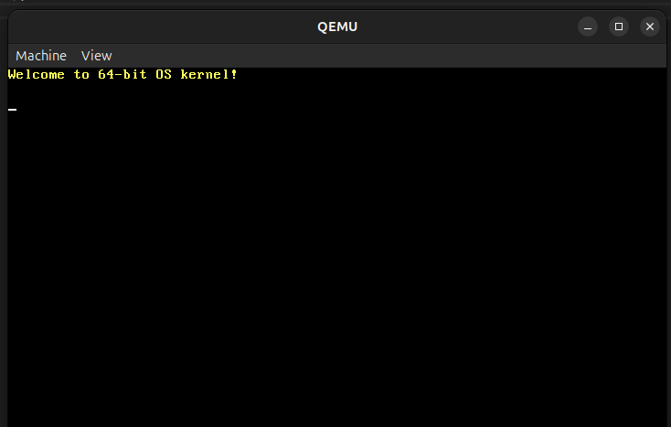

# 64-bit Custom Kernel



A custom 64-bit operating system kernel built with a Docker-based build environment, targeting x86_64 architecture.

## Prerequisites

- A text editor such as [VS Code](https://code.visualstudio.com/).
- [Docker](https://www.docker.com/) for creating our build environment.
- [Qemu](https://www.qemu.org/) for emulating our operating system.

> **Note:** Remember to add Qemu to your PATH so that you can access it from your command line. ([Windows instructions here](https://www.qemu.org/download/#windows))

## Setup

Build an image for our build environment:

```sh
docker build buildenv -t myos-buildenv
```

## Build

Enter the build environment:

- **Linux or macOS:**
  ```sh
  docker run --rm -it -v "$(pwd)":/root/env myos-buildenv
  ```

- **Windows (CMD):**
  ```cmd
  docker run --rm -it -v "%cd%":/root/env myos-buildenv
  ```

- **Windows (PowerShell):**
  ```powershell
  docker run --rm -it -v "${PWD}:/root/env" myos-buildenv
  ```

> **Note:** If you are using WSL, msys2, or Git Bash, please use the Linux command above.

> **Note:** If you are having trouble with an unshared drive, ensure your Docker daemon has access to the drive your development environment is in. For Docker Desktop, this is in **Settings > Shared Drives** or **Settings > Resources > File Sharing**.

Build for x86_64 (other architectures may come in the future):

```sh
make build-x86_64
```

> If you are using Qemu, please close it before running this command to prevent errors.

To leave the build environment, enter:

```sh
exit
```

## Emulate

You can emulate your operating system using Qemu (don't forget to add Qemu to your PATH!):

```sh
qemu-system-x86_64 -cdrom dist/x86_64/kernel.iso
```

> **Note:** Close the emulator when finished, so as to not block writing to `kernel.iso` for future builds.
